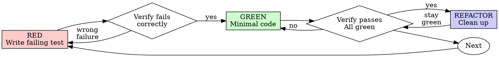

# Test-Driven Development (TDD)

## Overview

Test first. Watch it fail. Write minimal code to pass.

**Core principle:** Didn't watch the test fail? You don't know it tests the right thing.

**Break the letter of the rules = break the spirit.**

## When to Use

Always: new features, bug fixes, refactors, behavior changes.

Exceptions (ask your human partner): throwaway prototypes, generated code, config files.

"Skip TDD just this once"? Stop. That's rationalization.

## The Iron Law

```
NO PRODUCTION CODE WITHOUT A FAILING TEST FIRST
```

Code before the test? Delete it. Start over. Don't keep it as "reference", don't "adapt" it, don't look at it. Delete means delete. Implement fresh from tests.

## Red-Green-Refactor



### RED — write failing test

One minimal test. Shows what should happen.

<Good>
```typescript
test('retries failed operations 3 times', async () => {
  let attempts = 0;
  const operation = () => {
    attempts++;
    if (attempts < 3) throw new Error('fail');
    return 'success';
  };

  const result = await retryOperation(operation);

  expect(result).toBe('success');
  expect(attempts).toBe(3);
});
```
Clear name, real behavior, one thing
</Good>

<Bad>
```typescript
test('retry works', async () => {
  const mock = jest.fn()
    .mockRejectedValueOnce(new Error())
    .mockRejectedValueOnce(new Error())
    .mockResolvedValueOnce('success');
  await retryOperation(mock);
  expect(mock).toHaveBeenCalledTimes(3);
});
```
Vague name, tests mock not code
</Bad>

One behavior. Clear name. Real code (no mocks unless unavoidable).

### Verify RED — watch it fail

MANDATORY. Never skip. Run via `bash`:

```bash
npm test path/to/test.test.ts
```

Confirm: fails (not errors), failure message is the expected one, fails because feature missing (not a typo).

Passes? Testing existing behavior — fix the test. Errors? Fix, rerun till it fails right.

### GREEN — minimal code

Simplest code that passes.

<Good>
```typescript
async function retryOperation<T>(fn: () => Promise<T>): Promise<T> {
  for (let i = 0; i < 3; i++) {
    try {
      return await fn();
    } catch (e) {
      if (i === 2) throw e;
    }
  }
  throw new Error('unreachable');
}
```
Just enough to pass
</Good>

<Bad>
```typescript
async function retryOperation<T>(
  fn: () => Promise<T>,
  options?: {
    maxRetries?: number;
    backoff?: 'linear' | 'exponential';
    onRetry?: (attempt: number) => void;
  }
): Promise<T> {
  // YAGNI
}
```
Over-engineered
</Bad>

Don't add features, refactor other code, or "improve" past the test.

### Verify GREEN — watch it pass

MANDATORY.

```bash
npm test path/to/test.test.ts
```

Confirm: passes, other tests still pass, output pristine (no errors/warnings).

Fails? Fix code, not test. Other tests fail? Fix now.

### REFACTOR — clean up

After green only: kill duplication, improve names, extract helpers. Stay green. Don't add behavior.

### Repeat

Next failing test, next feature.

## Good Tests

| Quality | Good | Bad |
|---------|------|-----|
| **Minimal** | One thing. "and" in name? Split it. | `test('validates email and domain and whitespace')` |
| **Clear** | Name describes behavior | `test('test1')` |
| **Shows intent** | Demonstrates desired API | Obscures what code should do |

## Common Rationalizations

| Excuse | Reality |
|--------|---------|
| "Too simple to test" | Simple code breaks. Test takes 30 seconds. |
| "I'll test after" | Tests passing immediately prove nothing. |
| "Tests after achieve same goals" | Tests-after = "what does this do?" Tests-first = "what should this do?" |
| "Already manually tested" | Ad-hoc ≠ systematic. No record, can't re-run. |
| "Deleting X hours is wasteful" | Sunk cost. Keeping unverified code is tech debt. |
| "Keep as reference, write tests first" | You'll adapt it. That's testing after. Delete means delete. |
| "Need to explore first" | Fine. Throw away exploration, start with TDD. |
| "Test hard = design unclear" | Listen to the test. Hard to test = hard to use. |
| "TDD will slow me down" | TDD faster than debugging. Pragmatic = test-first. |
| "Manual test faster" | Manual doesn't prove edge cases. You'll re-test every change. |
| "Existing code has no tests" | You're improving it. Add tests for it. |

## Red Flags — STOP and Start Over

- Code before test
- Test passes immediately, or you can't explain why it failed
- "I'll test after" / "tests after achieve the same purpose"
- "Keep as reference" / "adapt existing code"
- "Already spent X hours, deleting is wasteful"
- "TDD is dogmatic, I'm being pragmatic" / "this is different because…"

All mean: delete code, start over with TDD.

## Example: Bug Fix

**Bug:** empty email accepted.

**RED**
```typescript
test('rejects empty email', async () => {
  const result = await submitForm({ email: '' });
  expect(result.error).toBe('Email required');
});
```

**Verify RED**
```bash
$ npm test
FAIL: expected 'Email required', got undefined
```

**GREEN**
```typescript
function submitForm(data: FormData) {
  if (!data.email?.trim()) {
    return { error: 'Email required' };
  }
  // ...
}
```

**Verify GREEN**
```bash
$ npm test
PASS
```

**REFACTOR** — extract validation for more fields if needed.

## Verification Checklist

- [ ] Every new function/method has a test
- [ ] Watched each test fail before implementing
- [ ] Each test failed for the expected reason (feature missing, not a typo)
- [ ] Wrote minimal code to pass
- [ ] All tests pass, output pristine
- [ ] Tests use real code (mocks only if unavoidable)
- [ ] Edge cases and errors covered

Can't check all? You skipped TDD. Start over.

## When Stuck

| Problem | Solution |
|---------|----------|
| Don't know how to test | Write the wished-for API. Assertion first. Ask your human partner. |
| Test too complicated | Design too complicated. Simplify the interface. |
| Must mock everything | Code too coupled. Use dependency injection. |
| Test setup huge | Extract helpers. Still complex? Simplify design. |

## Debugging Integration

Bug? Write a failing test reproducing it. Follow the cycle — the test proves the fix and blocks regression. Never fix bugs without a test. (See **superpowers-systematic-debugging**.)

## Testing Anti-Patterns

Adding mocks/test utils? Consult the **Testing Anti-Patterns** reference (auto-included below): testing mock not real behavior; test-only methods in prod classes; mocking without understanding deps.

## Final Rule

```
Production code → test exists and failed first
Otherwise → not TDD
```

No exceptions without your human partner's permission.
